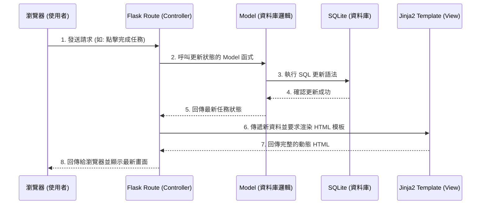

# 系統架構文件 (Architecture Design)

## 1. 技術架構說明

本專案為「任務管理系統」，根據 PRD 的需求，我們採用以下技術：
- **後端框架**：**Python + Flask**
  - **原因**：Flask 是輕量的框架，非常適合快速打造小型應用，學習曲線平滑且擴充性強。
- **模板引擎**：**Jinja2**
  - **原因**：Flask 內建 Jinja2，能直接在後端與 HTML 之間傳遞變數，利用迴圈與條件判斷產生動態頁面，不需額外的前端框架，開發效率高。
- **資料庫**：**SQLite**
  - **原因**：不需要額外安裝或設定獨立的資料庫伺服器，資料儲存在單一檔案中，非常適合個人單機使用的輕便專案。

### Flask MVC 模式說明
雖然 Flask 原生沒有硬性規定，但我們依循 MVC (Model-View-Controller) 的概念來組織架構：
- **Model (資料庫模型)**：負責定義資料庫結構，例如「任務」對應的資料表結構 (包含 ID、標題、完成狀態等)，處理與資料庫互動的邏輯。
- **View (視圖)**：由 Jinja2 所渲染的 HTML 模板，負責將從控制器拿到的任務數據經過排版顯示給使用者。
- **Controller (控制器)**：在 Flask 中由 **Routing (路由)** 擔任。接收使用者的請求 (例如點擊「新增任務」)，呼叫對應的 Model 處理資料，並將數據傳給對應的 Jinja2 View 進行畫面渲染。

## 2. 專案資料夾結構

本專案採用的資料夾結構如下，幫助團隊更清楚每個檔案的責任：

```text
web_app_development/
├── app/
│   ├── models/           ← [Model] 資料庫模型與操作邏輯 (例如：task_model.py)
│   ├── routes/           ← [Controller] Flask 路由設定 (處理新增、刪除等請求)
│   ├── templates/        ← [View] Jinja2 HTML 模板檔案 (如 index.html)
│   └── static/           ← CSS 樣式表、JavaScript 及圖片等靜態資源
├── instance/
│   └── database.db       ← 實際的 SQLite 資料庫檔案 (不建議加入 Git 版控)
├── docs/                 ← 專案設計文件 (PRD.md、ARCHITECTURE.md 等)
├── app.py                ← 應用程式的進入點，負責啟動 Flask 伺服器
└── 實作說明.md             ← 課程任務說明文件
```

## 3. 元件關係圖

以下流程圖呈現使用者在瀏覽器操作時，系統內各元件間的互動方式：



## 4. 關鍵設計決策

1. **伺服器端渲染 (SSR)**：
   本專案不會採用前後端分離架構，頁面將統一由 Flask + Jinja2 結合渲染 (伺服器端渲染)。此設計能大幅減少 API 串接、跨網域 (CORS) 等麻煩問題，是最適合快速交付 MVP 版本的方式。
2. **路由邏輯被拆分 (Blueprint 概念)**：
   為避免所有程式碼全部塞入 `app.py` 中變得龐大且難以維護，我們會將「任務相關路由」從 `app.py` 拆解放入 `app/routes/` 裡，再引入到 `app.py` 以維持整潔。
3. **無須龐大的 ORM**：
   因為這是一個單純的新增、刪除、修改、讀取的應用程式，初版架構我們可以優先考慮使用內建的 `sqlite3` 直連或輕量級輔助工具與資料庫互動，降低專案過度設計的風險。
