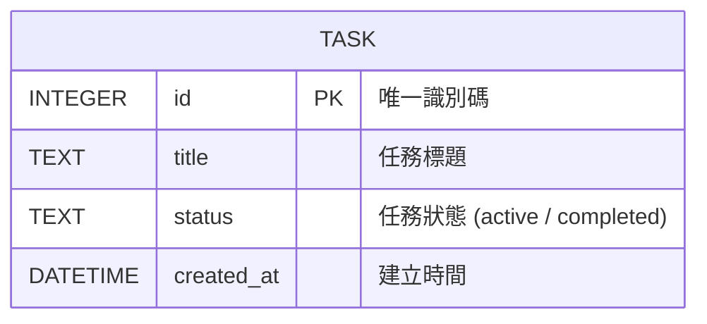

# 資料庫設計 (Database Design)

## 1. ER 圖（實體關係圖）

我們採用一個單純的資料表 `tasks` 來儲存任務資料，避免過度設計。

## 2. 資料表詳細說明

### `tasks` 資料表

負責儲存使用者建立的各項待辦任務資料。

| 欄位名稱 | 型別 | 是否必填 | 預設值 | 說明 |
| :--- | :--- | :--- | :--- | :--- |
| `id` | INTEGER | 是 | (自動遞增) | Primary Key，確保每筆紀錄的唯一性 |
| `title` | TEXT | 是 | 無 | 任務標題與內容描述 |
| `status` | TEXT | 是 | 'active' | 任務當前狀態，以 'active' (未完成) 或 'completed' (已完成) 做區分 |
| `created_at` | DATETIME | 是 | CURRENT_TIMESTAMP | 資料庫寫入任務時的當下時間戳記 |

## 3. SQL 建表語法
完整的建表語法指令我們放在了 `database/schema.sql` 裡面。未來如果有重置資料庫的需求，可以直接執行這個檔案。

## 4. Python Model 程式碼
因為我們使用的是 SQLite，且本系統結構簡單，我們不必使用龐大的 ORM（如 SQLAlchemy），而是使用 Python 內建的 `sqlite3`。
這部分的 CRUD (新增、讀取、更新、刪除) 的資料庫操作，已經統一寫入並封裝至 `app/models/task_model.py` 中。未來 Controller (Routing) 只要呼叫對應功能就能處理資料了。
