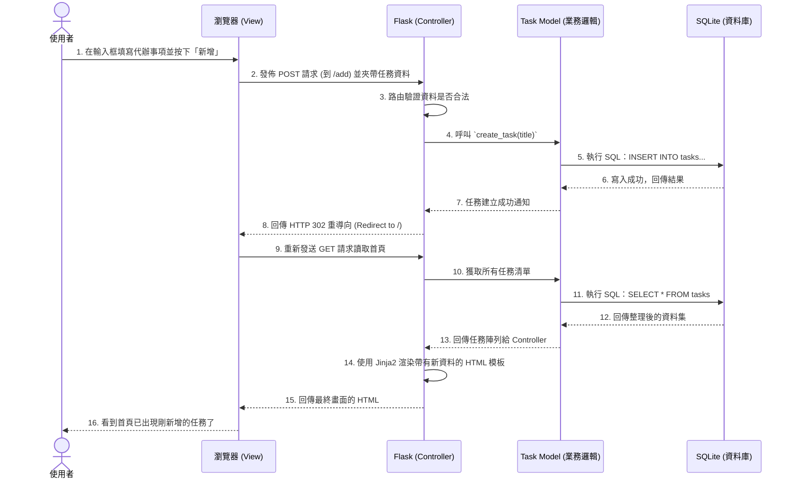

# 流程圖設計 (Flowchart Design)

## 1. 使用者流程圖 (User Flow)

這張流程圖描述使用者進入任務管理系統後，可能進行的各種操作路徑，主要皆以首頁為核心互動區域。

```mermaid
flowchart LR
    A([使用者開啟網頁]) --> B[首頁 - 任務清單]
    
    B --> C{選擇操作}
    
    C -->|輸入內容並送出| D[新增任務]
    D --> E{資料驗證}
    E -->|成功| F[儲存任務] --> B
    E -->|失敗 (如空值)| G[提醒輸入標題] --> B
    
    C -->|點擊任務旁的勾選| H[切換任務完成狀態]
    H --> I[更新資料庫狀態] --> B
    
    C -->|點擊刪除按鈕| J[刪除任務]
    J --> K[移除該筆資料] --> B
    
    C -->|點擊篩選頁籤| L[篩選: 全部/已完成/未完成]
    L --> M[依條件重新顯示任務列表] --> B
```

## 2. 系統序列圖 (Sequence Diagram)

這張系統流程圖詳細描述了核心功能「新增任務」時，從前端到後端與資料庫之間是如何溝通互動的。



## 3. 功能清單對照表

根據先前的 PRD，我們總結出所有操作在 Web 應用程式裡對應的 URL 路徑 (Routes)。

| 功能名稱 | URL 路徑 | HTTP 方法 | 功能與預期行為說明 |
| :--- | :--- | :--- | :--- |
| **首頁 (顯示任務清單)** | `/` | GET | 渲染首頁模板。可以加上參數做篩選 (例如 `/?filter=completed` 或 `/?filter=active`) |
| **新增任務** | `/add` | POST | 接收 HTML 表單的輸入內容，建立一筆新任務後導回首頁 |
| **標記任務完成與否** | `/toggle/<int:task_id>` | POST | 更動該 `task_id` 任務的完成狀態，完成後重新導向回首頁 |
| **刪除任務** | `/delete/<int:task_id>` | POST | 刪除對應 ID 的那筆資料，操作完畢後導回首頁 |

> 補充說明：關於變更系統狀態的操作 (新增、完成、刪除)，皆設定為 `POST` 以確保與 REST 原則契合以及基本安全性，並在操作完後利用重導向 (Redirect) 返回首頁，防止使用者重複送出表單。
